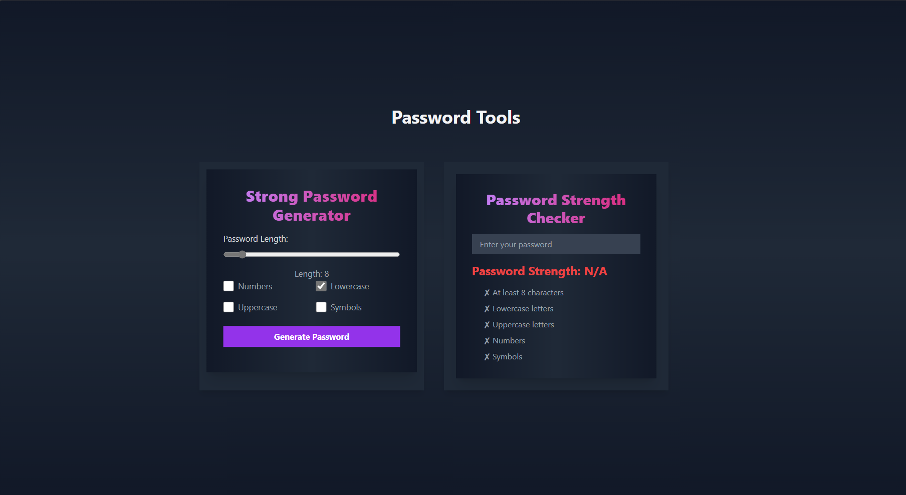

# Password Generator & Strength Checker

This project consists of two modern and interactive tools: a **Password Generator** and a **Password Strength Checker**, built using **Next.js**, **React**, and **Tailwind CSS** with a dark theme design.

## Demo

You can check out a live demo here: [Live Demo](https://password-generator-zeta-mocha.vercel.app/).


## Features

### 1. Password Generator
- Generate strong passwords based on user-selected criteria:
  - Include uppercase letters
  - Include lowercase letters
  - Include numbers
  - Include special characters
- Adjust password length using a slider.
- Copy the generated password to the clipboard with a smooth animation.

### 2. Password Strength Checker
- Evaluate the strength of a password based on various criteria:
  - Password length
  - Use of lowercase letters
  - Use of uppercase letters
  - Inclusion of numbers
  - Presence of special symbols
- The strength is visually represented as **Weak**, **Medium**, or **Strong** with a smooth transition.
- Animated suggestions are provided on how to improve the password strength.

## Technologies Used
- **Next.js**: For server-side rendering and optimized performance.
- **React**: For building the user interface.
- **Tailwind CSS**: For styling, including the dark theme and animations.
- **TypeScript**: For type safety and improved development experience.

## Installation

### Prerequisites
- Node.js installed on your machine.
- A package manager like npm or yarn.

### Steps
1. Clone this repository:
   ```bash
   git clone https://github.com/your-username/password-generator-strength-checker.git
   cd password-generator-strength-checker
   ```

2. Install the dependencies:
   ```bash
   npm install
   # or
   yarn install
   ```

3. Start the development server:
   ```bash
   npm run dev
   # or
   yarn dev
   ```

4. Open your browser and go to `http://localhost:3000`.

## File Structure

```
├── components
│   ├── PasswordGenerator.tsx
│   ├── PasswordStrengthChecker.tsx
├── pages
│   └── index.tsx (or Home.tsx)
├── public
│   ├── favicon.png
│   ├── logo.png
└── styles
    └── globals.css (for additional global styling)
```

## Customization

### Tailwind Configuration
Tailwind CSS is used for styling. You can customize the colors, transitions, and animations by editing the `tailwind.config.js` file.

### Animation and Effects
This project uses hover effects, transitions, and scaling animations to make the UI interactive. If you want to adjust these animations, you can do so in the respective component files (`PasswordGenerator.tsx`, `PasswordStrengthChecker.tsx`).


## Future Enhancements
- Allow users to customize the password strength criteria.
- Add more complex password validation (e.g., avoiding dictionary words).
- Enhance UI animations further to improve UX.

## Contributing
Feel free to fork this repository, make changes, and submit a pull request. Any suggestions or improvements are welcome!

